# Methodology

This file contains the analysis steps used to get trip data from [Replica](https://studio.replicahq.com/). Replica is a Big Data Platform that uses mobility data that represents what travel looks like during a typical Weekday (Thursday) or Weekend (Saturday) during the Fall or Spring time. Within the platform, we can filter the types of trips to a specific location, time, mode, or various other trip and traveler attributes. 

For this specific analysis, we are interested in looking at where people are traveling to and from within each region of California. Because there are a few million trips occuring on any given day, we split the data downloads into [Regional Transportation Planning Commission Areas](https://gis.data.ca.gov/datasets/CAEnergy::regional-transportation-planning-agencies/explore?location=37.269174%2C-119.306607%2C6). From there we looked at trips over 45 minutes and selected the the top 50 locations within each RTPA. The following analysis steps detail how we retrieved the data. 

## Analysis Steps

1. Create a new study in [Replica](https://studio.replicahq.com/).
    * Login to [Replica](https://studio.replicahq.com/)
         * If you need an account, please go to Data & Digital Services OnRamp Page to access the Big Data Resource Center
    * Click the `New Study` or `New Study from Scratch`
      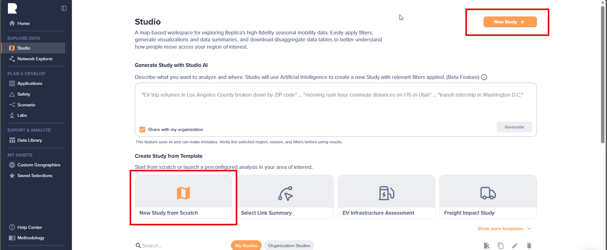
       
       
    * Name the study **`STM_{RTPA}_{origins or destinations}`**
         * Example: *STM_MTC_Origins*
    * Choose `Cal-Nev` as the Region
    * Choose `Spring 2025` as the Season
    * Choose `Thursday` as the Typical Day

2. Add Filters for Trip Duration
    * In the top left corner, select the white plus icon to add a new filter
    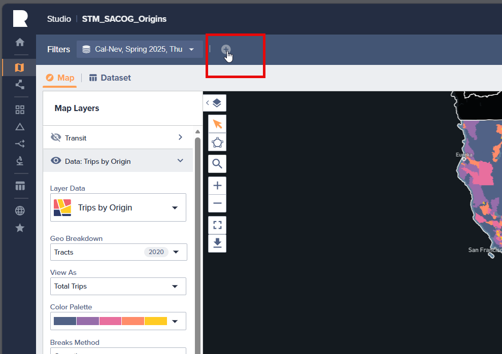
       
       
    * Scroll and select `Trip Duration (Minutes)` or select `Trips` to narrow down the filter options and find the filter we are looking for
    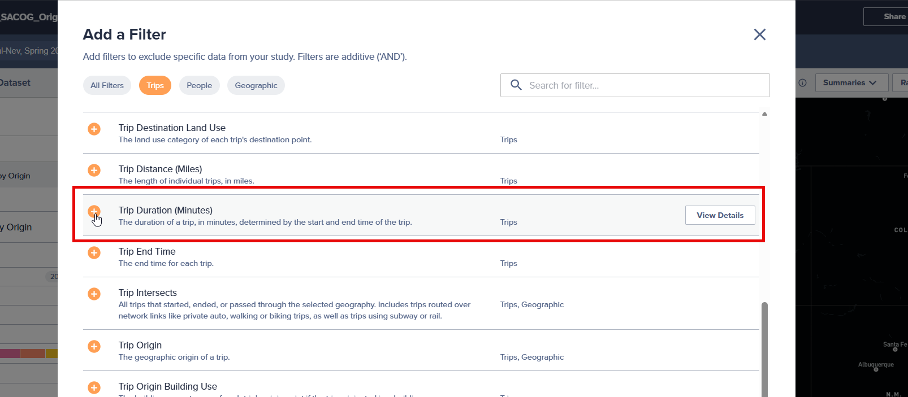
       
       
    * Change the trip minimum to `45` and select `Apply Filter`
    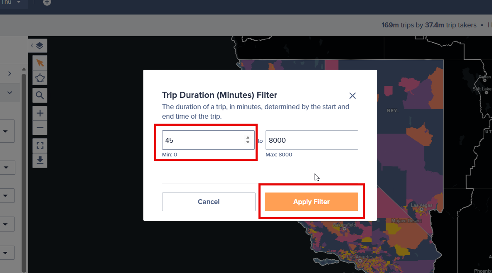
       
       

      
3. Add Trip Origin/Destination Filter
    * Go back to the white plus mark to add a new filter. Select `Trip Origin` or `Trip Destination` (depending on which analysis you are running)
    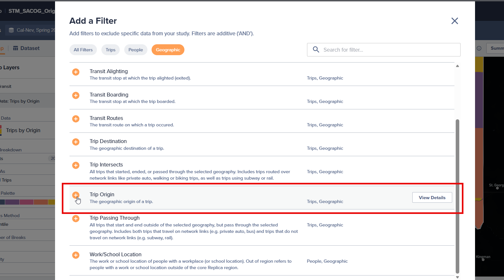
       
       
    * Select RTPA from the `User Custom`/`Org Custom`, which are uploaded RTPA geometries for the state
    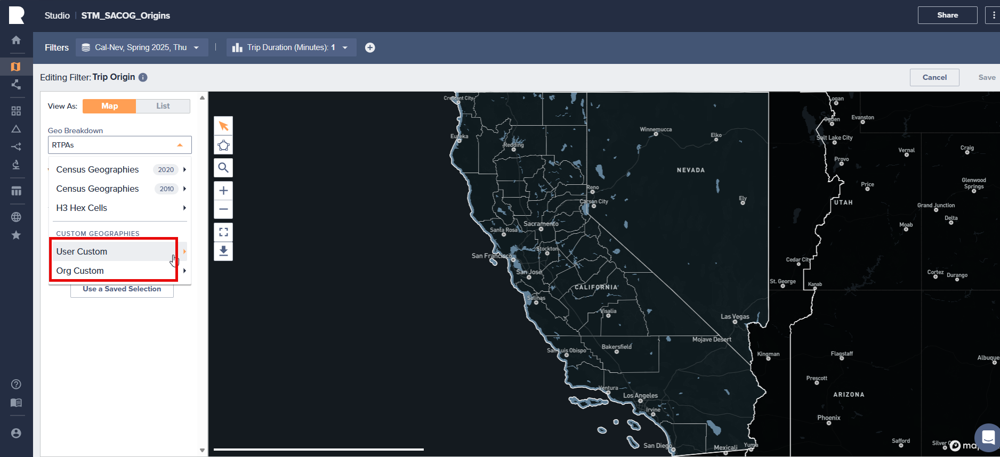
       
       

    * Once the layer is loaded, select one of the geometries in the map that matches you analysis name. *In this example, we will be selecting the SACOG geometry*. Once you select the geometry, it will populate on the left hand side of the screen. Then click `Save`
    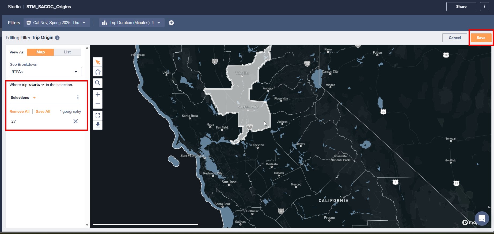
       
       
4. Change Geo Breakdown to Hex Cells
    * Once the geometry is filtered down to the RTPA, we will need to change the geo breakdown to get a more granular result
    * Ensure you are on the main study page
    * On the left hand side of the screen, there should be a `Geo Breakdown` section below the `Layer Data`. The default should be set to "Tracts."
    * Click the `Tracts` option and navigate to `H3 Hex Cells` option
    * Then select `H3 Hex Cells Resolution 7 (~2 sq mi/cell)`
    * Zoom in to the layer to see the Hex Cells
    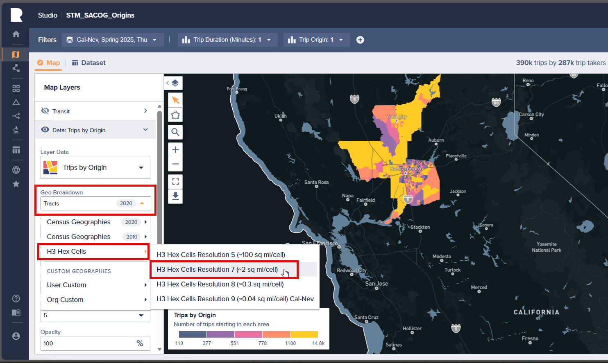
       
       

5. Replacing Origin/Destination Filters to the top 50
    * Now that we have the right geo breakdown, we will alter the origin/destination filter to the top 50 hex cells that tips are starting/ending respectively.
    * In the top right corner, click `Rankings` to get a pop out that will automatically rank the hex cells (we will change this since the default is different than what we are looking for.)

    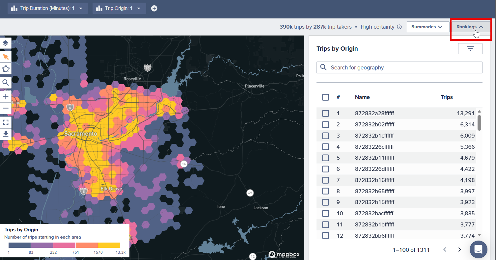
       
       

    * Click the filter button within the popout (should be in the top right of the popout window)
        * Additional options will show once the filter button is clicked.
    * Select the `Rank` option
    * Ensure `Top` is selected
    * Enter `50` in the written option
    * Now there should be 50 hex cell ids populated in the rankings
    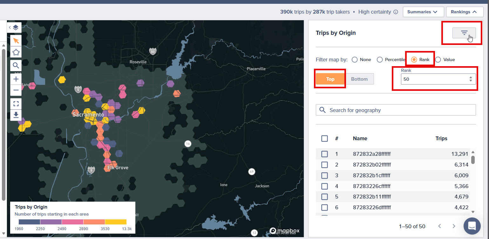
       
       
      
    * Click the box at the top of the list to select all 50 hex cells
    * A small window will then pop up in the top right corner of the map with the option to add the geo filter.
    * Click the option `Add Geo Filter`
    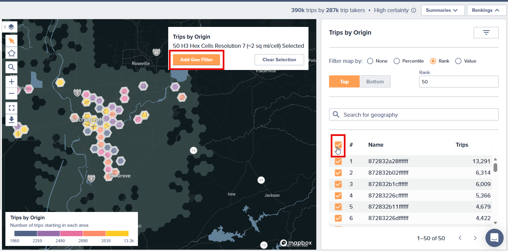
       
       

    * A new window will pop up with all 50 hex cells already selected.
        * You can check the number at the top of the selected geometries list that there are 50
    * Click `Save`
    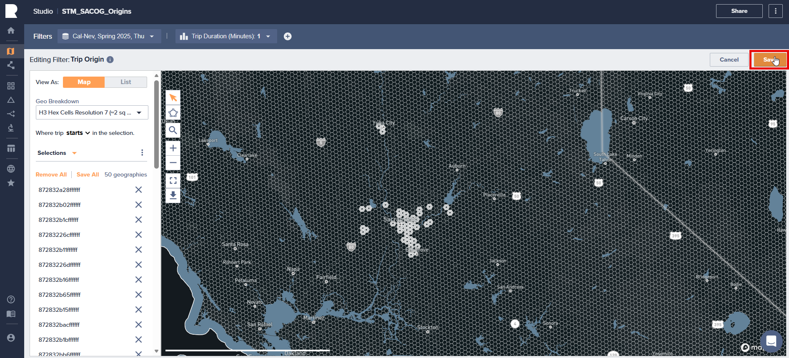
       
       

6. Downloading Data
    * To download data, click `Dataset` at the top of the screen, just under the filters.
    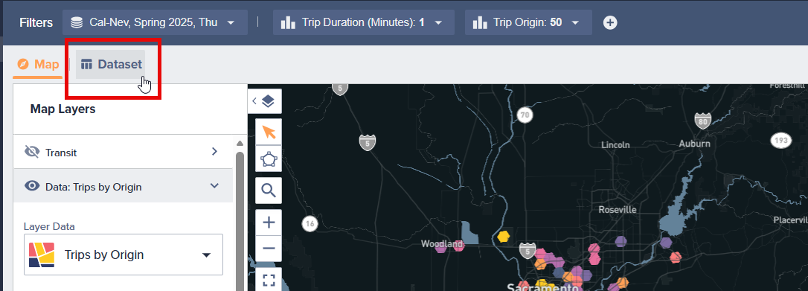
       
       
    * Ensure the `Trips` data is selected.
    * Then select `Manage Attributes` to add the Hex Cell Geometries
    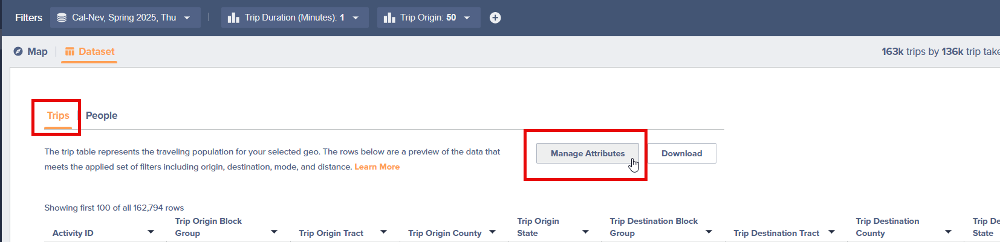
       
       

    * Once `Manage Attributes` is selected, a new window will pop up
    * In the top right of the pop up window, there will be an option to add `Custom Geography Attributes`
    * Add the `CA_hex7_geobreakdown` that should be accessible under the Org Custom
    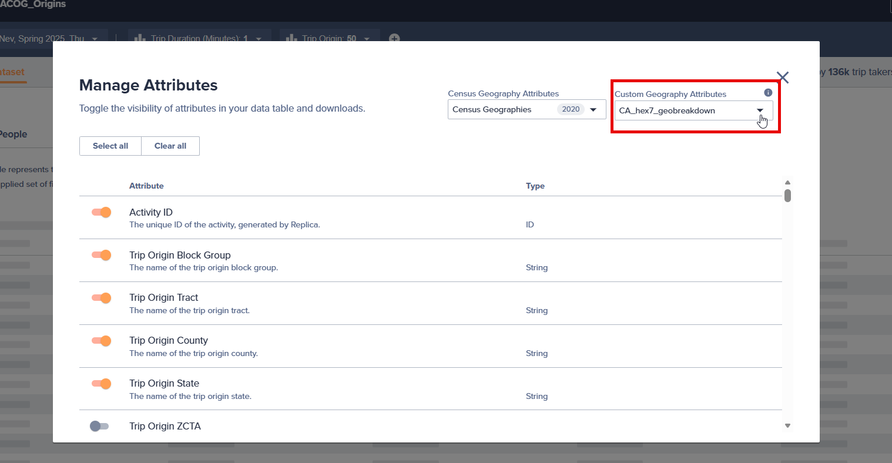
       
       

    * Also in this window we have the option to add additional columns
    * Toggle on the following columns
        * `Trip Origin Custom Geography`
        * `Trip Destination Custom Geography`
        * `Trip Origin Custom Geography ID`
        * `Trip Destination Custom Geography ID`
        * `Trip Origin Custom Geography Centroid Longitude`
        * `Trip Origin Custom Geography Centroid Latitude`
        * `Trip Destination Custom Geography Centroid Latitude`
        * `Trip Destination Custom Geography Centroid Longitude`
        * `Trip Start Local Hour`
        * `Trip End Local Hour`
    * And any other column that might be of interest
    * Once those are selected, exit out of the window

    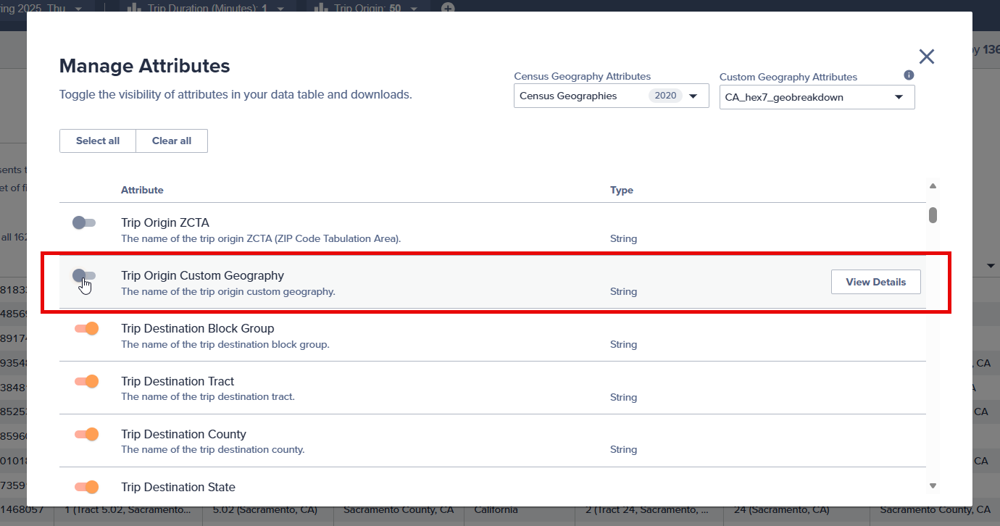
       
       

    * Click the `Download` Button
    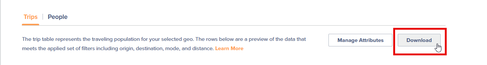
       
       
